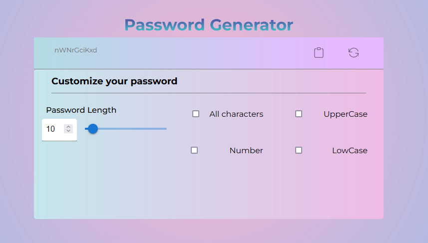

# Initial Documentation - Front-end

 

- Setup next-js
  - Utilizando a bibliteca do nextjs conseguimos iniciar um template:
    `$ npx create-next-app`
  - Configuration of [styled components](https://styled-components.com/docs/basics)
  - Criação de componentes globais e paginas
    - Page - Home
    - Components - Home - Title - Header(Output password) - password view - copy and refresh - Main(Customize our hash) - main title - password length(slide) - checkbox (uppercase or lowercase)
